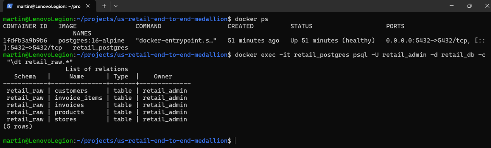

# US Retail End-to-End Medallion Project

An end-to-end data engineering portfolio project simulating a large US supermarket chain.

**Goal:** Generate 1M synthetic transactions with realistic data quality issues, ingest into Postgres as OLTP source, build a Medallion Architecture (Raw -> Bronze -> Silver -> Gold) on Databricks with PySpark + Delta Lake, and serve Gold tables to Power BI for executive dashboards.

**Business Context:** USA only. 50 stores across 4 US Census regions. 2,500 products, 100k customers.

## Architecture
[Host Win11] -> [WSL2 Ubuntu 24.04: Docker Engine + Postgres 16]
-> [VMWare Win11 Dev VM: Python, DBeaver, VS Code]
-> [Databricks Free Edition: Delta Lake]
-> [Power BI: Gold Layer]

See docs/03_medallion_flow.md for diagram.

## Tech Stack
- Source Generation: Python, Faker (en_US), PyYAML
- OLTP Source: Postgres 16 on Docker in WSL2
- Transformation: PySpark, Delta Lake, Databricks
- BI: Power BI Desktop / Tableau
- Infra: WSL2, Docker Compose, VMware Workstation, Git

### Postgres Ready

## How to Run (Milestone 1 & 2)
1. Copy .env.example to .env
2. Start Postgres: `docker compose up -d` from project root in WSL2
3. Generate data: `python 02_data_generation/generate_retail_data.py` (inside VMware VM)
4. Load to Postgres: `python 03_ingestion/load_csv_to_postgres.py`
5. Verify in DBeaver

## Resource Allocation for 64GB RAM Machine
- Host: 12GB
- WSL2: 16GB (via .wslconfig)
- VMware Dev VM: 32GB, 8 vCPU, 150GB NVMe dynamic
- Postgres container: 4GB limit

## Medallion Layers
- Raw: Postgres tables = system of record
- Bronze: Exact copy from Postgres via JDBC, no transforms, incremental load via watermark on invoice_date
- Silver: Deduplication, null handling, type casting, SCD2 for products
- Gold: Star schema for BI - fact_sales, dim_store, dim_product, dim_customer, agg_sales_by_region, agg_product_performance

## Dashboards Planned
1. Regional Director: Sales by state/region, store performance, YoY growth map
2. Product Manager: Category performance, basket analysis, discount impact, out-of-stock simulation

## Milestones

### M1 - Infra & Postgres - DONE
- WSL2 Docker Postgres 15, permissive table retail_raw with only raw_id PK
- Docs: 00_setup.md, 01_postgres_infra.md, 02_architecture_decisions.md
- Repo live on GitHub

### M2 - Data Generation - DONE
- Generator: 02_data_gen/generate_retail_data.py
- 1,000,000 rows retail_raw.csv with 2% error injection (nulls, invalid IDs, negatives, future dates)
- Validated: 1,000,000 rows
- Docs: 04_data_generation.md

### M3 - Load to Postgres (Raw Layer) - DONE
Raw layer is permissive - it allows NULLs, bad types, and stores ingestion metadata.

### Infrastructure (WSL2 / Host / DEV VM)
We run Postgres in Docker inside **WSL2 Ubuntu**. DEV VM cannot reach WSL2 directly, so Host acts as router.

### M4 - Databricks Bronze/Silver/Gold - TODO
### M5 - Data Quality - TODO
### M6 - Orchestration - TODO
### M7 - Power BI - TODO
### M8 - Final Docs - TODO